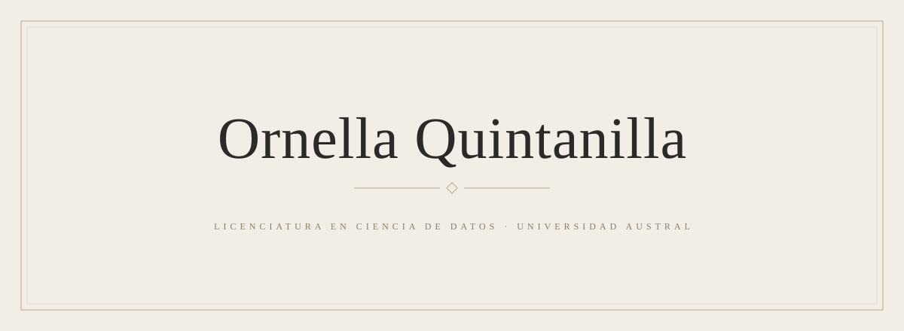

  

 

I &nbsp;·&nbsp; SOBRE MÍ

  Me interesa la intersección entre <b>datos, tecnología, moda y creatividad</b>. 
  Me atrae comprender cómo los datos se transforman en información valiosa, 
  pero también el lado creativo: la identidad visual, el diseño, la cultura 
  y la forma en que las personas se vinculan con las marcas.

 

II &nbsp;·&nbsp; ACTUALMENTE

| | |
|:--|:--|
| ESTUDIANDO | Licenciatura en Ciencia de Datos — Universidad Austral |
| APRENDIENDO | Python · R · SQL · Data Visualization · Git & GitHub |
| DESARROLLANDO | Análisis de datos, visualización, inteligencia artificial y aplicaciones empresariales |

 

III &nbsp;·&nbsp; MODA × DATOS

  Una de las áreas que más me intriga es la relación entre los datos y la moda: 
  cómo el análisis cuantitativo puede iluminar el mundo del lujo y del diseño.

| | |
|:--|:--|
| Comportamiento del consumidor | Tendencias de moda |
| Lujo y venta minorista | Segmentación de clientes |
| CRM y marketing | Posicionamiento de marca |
| Cultura visual | Toma de decisiones creativa |

 

IV &nbsp;·&nbsp; MI ENFOQUE

  <i>Me gusta entender <b>por qué</b> algo funciona, no solo aprender a reproducirlo.</i>

  Me tomo el tiempo necesario para comprender cada tema en profundidad: 
  creo que el verdadero aprendizaje pide paciencia, atención y dedicación. 
  Vivo esta carrera con genuino interés. Cada materia, desde la más técnica 
  hasta la más conceptual, deja algo valioso y suma a una forma más completa de pensar.

 

V &nbsp;·&nbsp; DIRECCIONES FUTURAS

  CIENCIA DE DATOS 
  ↓ 
  MODA Y LUJO 
  ↓ 
  ANÁLISIS DEL CONSUMIDOR 
  ↓ 
  IA Y TECNOLOGÍA CREATIVA

  <i>A largo plazo, construir un perfil internacional donde converjan datos, tecnología y moda.</i>

 

VI &nbsp;·&nbsp; HERRAMIENTAS

  
  
  
  
  
  
  

 

VII &nbsp;·&nbsp; IDIOMAS

| | |
|:--|:--|
| Español | NATIVO |
| Inglés | B2 |
| Italiano | B1 |

 

VIII &nbsp;·&nbsp; ACTUALMENTE EXPLORANDO

  Fashion analytics &nbsp;·&nbsp; Luxury & retail analytics &nbsp;·&nbsp; Consumer insights 
  Inteligencia artificial &nbsp;·&nbsp; Tecnología creativa aplicada a la moda

 

IX &nbsp;·&nbsp; CONTACTO

  <a href="mailto:ornellaquintanilla21@gmail.com">ornellaquintanilla21@gmail.com</a>

